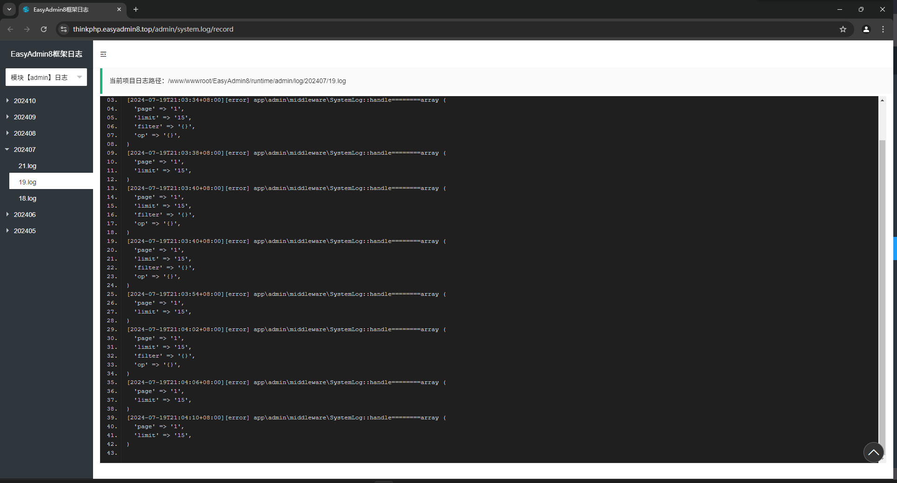

# PHP日志查看器

> 目前只支持ThinkPHP6+、ThinkPHP8+
> 要求 `php >= 7.4`

## 使用方法

```shell
composer require wolf-leo/phplogviewer
```

## 预览图



### ThinkPHP 框架中

```php
    public function test()
    {
        return (new \Wolfcode\PhpLogviewer\thinkphp\LogViewer())->fetch();
    }
```

> 可自定义配置
>
> 在 `config` 下新建 `logviewer.php` 文件

```php
<?php
return [

    // 日志标题
    'title'          => 'ThinkPHP 日志查看器',

    // 默认显示日志应用模块
    'default_module' => 'index',

    // 常用的日志应用模块
    'modules'        => [
        'admin',
        'home',
        'index',
        'api'
    ],
    
    // layui css 路径 如不设置，将默认调用公共CDN资源
    'layui_css_path' => '',
    // layui js 路径 如不设置，将默认调用公共CDN资源
    'layui_js_path'  => '',
    
];
```
